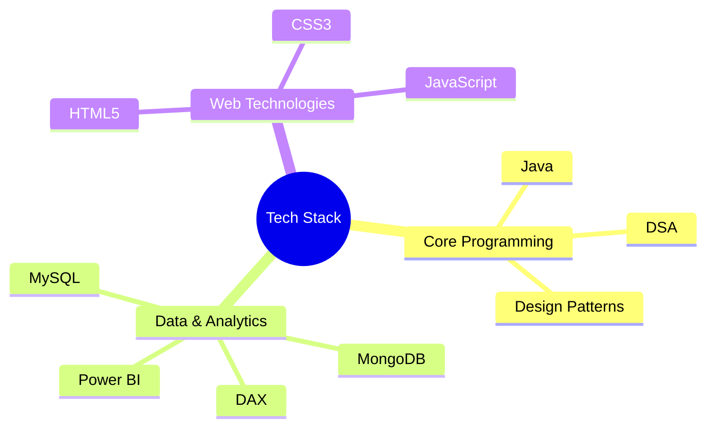

<div align="center">

# 👋 Hi there, I'm Dhruv Saxena!

### 💻 Aspiring Software Developer | ⚙️ Problem Solver | 📊 Data Enthusiast

[](https://www.linkedin.com/in/drvsaxenaofficial/)
[](https://dhruvsaxena.me/)
[](mailto:dhruvsaxena132@gmail.com)

</div>

---

## 🚀 About Me

```java
public class DhruvSaxena {
    private String education = "B.Tech in IT @ Bharti Vidyapeeth College of Engineering, Pune";
    private String[] currentFocus = {"DSA", "Data Analytics", "Database Management"};
    private String status = "Actively preparing for placements & building impactful projects";
    
    public void introduce() {
        System.out.println("Passionate about solving real-world problems through code!");
    }
}
```

🎓 **Education:** B.Tech in Information Technology from Bharti Vidyapeeth (Deemed to be University) College of Engineering, Pune

🎯 **Current Goals:** Sharpening problem-solving skills, mastering DSA, and building production-ready applications

📚 **Learning Journey:** Continuously exploring new technologies and best practices in software development

---

## 🛠️ Core Tech Stack

<div align="center">

### Programming & Development


### Database & Analytics


### Tools & Frameworks


</div>

---

## 💼 Featured Projects

### 🏧 ATM Transaction Management System
**Tech Stack:** `Java` `MySQL` `SHA-256 Encryption`

A comprehensive banking application simulating real-world ATM operations with secure authentication, transaction management, and PDF statement generation.

**Key Features:**
- Secure login with SHA-256 password hashing
- Account management (deposits, withdrawals, transfers)
- Mini statement generation with PDF export
- Transaction history tracking
- User-friendly console interface

---

### 📊 Hospitality Insights Dashboard
**Tech Stack:** `Power BI` `DAX` `Data Modeling`

An interactive business intelligence dashboard providing actionable insights for hotel management and revenue optimization.

**Key Features:**
- Real-time occupancy and revenue tracking
- Guest behavior analysis and trends
- KPI monitoring (ADR, RevPAR, occupancy %)
- Dynamic filtering and drill-down capabilities
- Professional visualizations for stakeholder reporting

---

### 🔐 Security Utility Program
**Tech Stack:** `Java` `Cryptography`

A lightweight encryption/decryption tool implementing XOR-based cipher for protecting sensitive text data.

**Key Features:**
- Fast XOR-based encryption algorithm
- Simple and intuitive interface
- Secure key-based encryption/decryption
- Text file processing capabilities

---

### 📈 DSA Tracker
**Tech Stack:** `HTML` `CSS` `JavaScript`

A personal progress tracking tool designed to organize DSA preparation and monitor problem-solving journey.

**Key Features:**
- Problem categorization by topic and difficulty
- Progress visualization
- Notes and solution storage
- Revision reminder system

---

## 📊 GitHub Stats

<div align="center">


</div>

---

## 🌱 Currently Learning

<div align="center">



</div>

---

## 🤝 Let's Collaborate!

I'm actively seeking opportunities to:

- 🌟 **Contribute** to open-source projects
- 💡 **Collaborate** on full-stack development projects
- 📊 **Build** data analytics and visualization solutions
- 🗣️ **Discuss** emerging technologies and best practices
- 🎓 **Learn** from experienced developers

---

## 📫 Get In Touch

<div align="center">

**Feel free to reach out for collaborations, discussions, or just a friendly chat about tech!**

[](https://www.linkedin.com/in/drvsaxenaofficial/)
[](https://dhruvsaxena.me/)
[](mailto:dhruvsaxena132@gmail.com)

---

### ⭐️ Thanks for visiting my profile!

*"Code is like humor. When you have to explain it, it's bad."* – Cory House


</div>
